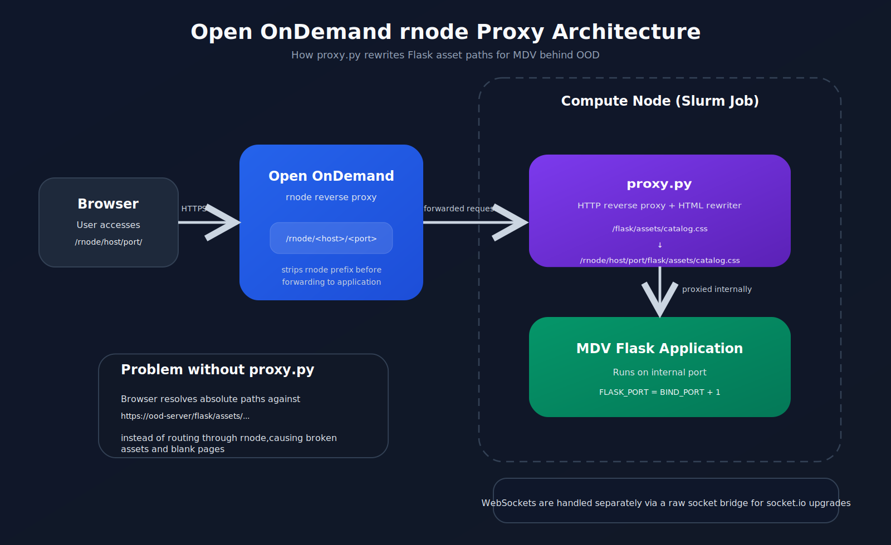

# Multi-Dimensional Viewer (MDV) app for BMRC OOD

# License & Attribution

The MIT license in this repository applies solely to the deployment scripts, configuration files, and documentation 
provided here for running MDV (https://mdv.ndm.ox.ac.uk/) on the BMRC cluster OpenOnDemand service at the University of Oxford. 
MDV itself is not covered by this license. 

All intellectual property rights for MDV remain with the original authors. Please refer to the [original license](https://github.com/Taylor-CCB-Group/MDV/blob/main/LICENSE) 
before using, modifying, or redistributing MDV.

# `template/proxy.py` 

MDV is designed to run as a standalone web server at the root path (`/`), with its Vite-built 
frontend referencing static assets using absolute URLs such as `/flask/assets/catalog.css` and `/flask/js/mdv.js`.

OpenOnDemand's reverse proxy (`rnode`) works by routing requests through a URL of the form `/rnode/<hostname>/<port>/path`
on the OOD server, stripping the `/rnode/<hostname>/<port>` prefix before forwarding to the application. This means 
the application itself always receives requests at the correct path — but the browser does not know about the stripping. 
When the browser loads a page served at `https://ood-server/rnode/host/port/`, it resolves absolute asset paths such as  
`/flask/assets/catalog.css` relative to the OOD server root, not through the rnode proxy. The result is 404 or 500 
errors for all static assets, leaving the application as a blank page.

A secondary complication arises from nested routes. When a user opens a project, the page URL deepens to something 
similar to `/rnode/host/port/project/1/``. Simply converting absolute paths to relative ones (e.g. `flask/assets/catalog.css`)
does not solve the problem here, because the browser would then resolve those relative paths against the current 
sub-path, producing incorrect URLs such as `/rnode/host/port/project/1/flask/assets/catalog.css`.

`proxy.py` solves this by sitting between OOD's rnode proxy and the MDV Flask application. Flask runs on an internal port 
(`BIND_PORT + 1`), invisible to OOD. The proxy listens on `BIND_PORT` (the port OOD knows about) and forwards all requests to 
Flask. For HTML responses specifically, it rewrites every absolute `/flask/` asset reference to a fully-qualified r
node-prefixed path — for example `/flask/assets/catalog.css` becomes `/rnode/<hostname>/<port>/flask/assets/catalog.css`. 
Because these are now absolute URLs that include the full rnode path, the browser routes them correctly through OOD's 
proxy to Flask regardless of the current page depth.

WebSocket connections (used by MDV's socket.io real-time features) are handled separately via a raw socket bridge, 
since HTTP-level proxying cannot perform the WebSocket protocol upgrade.
